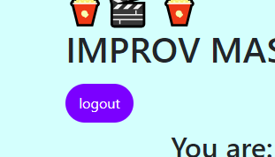

# SillyCode Valley

## Useage

Sillycode Valley is a video app that generates improv prompts for users to inspire wacky scenes that they can act out and share with other users. Of course, improv can be intimidating so once a user completes their improv session with the app, they will have the *option* to upload their video, as opposed to being forced to. Assuming the user likes their video though they can freely upload their file up the gallery to share with other users.  

*demo of the scrolling video gallery*  
 
Users will see a scrolling gallery of uploaded videos once they visit the homepage of SillyCode Valley. 

*users will see a landing page* 
  
When a user feels inspired to create a video, they click on the create video button at the bottom of the video gallery scroller. 

*login page for users* 
 
If a user wasn't already signed in when they clicked the create video button, they will be redirected to the the login page. Once they sign up or login, they will be free to navigate to the room. 

*once users once users login, they will be taken to the room page* 
 
*Once a user press the generate prompt button, they will receive a random prompt to inspire their improv performance*  
 <br.>
Once a user presses the record button, the room will record their video and audio for 20 seconds. Upon completion, the user will be able to download their video with the download button, and then upload it using the Cloudinary widget.  

*once a user completes their recording, they can review it before downloading and uploading* 
 
Users can review their recording and decide what they want to do with their video. If they want a private copy for themselves they may download a copy for themselves and if they like it enough, they will be free to upload it.  
 

*afer the user decides what they want to do with their video they can logout with the logout button or return to the homepage* 
 
Once the user clicks the logout or the homepage button, they will be returned back to the homepage 

## Technologies Used
Github 
Cloudinary 
Handlebars 
Sequelize 
Bootstrap css 
bcrypt 
express js 
mysql2 

## Special Thanks
Kayla Datte: [Github](https://github.com/kaylaasana) [Linkedin](https://www.linkedin.com/in/kayladatte/) 
Andy Godoy: [Github](https://github.com/AndyGodoy) [Linkedin](https://www.linkedin.com/in/andy-godoy-173111280/)

## Links
[Github Repo](https://github.com/Chapjae/sillyCode_valley) 
[Heroku Deployment](https://intense-sands-40473-ea199ebca0d8.herokuapp.com/) 
[Linkedin](https://www.linkedin.com/in/jay-liu-3208a3bb/)